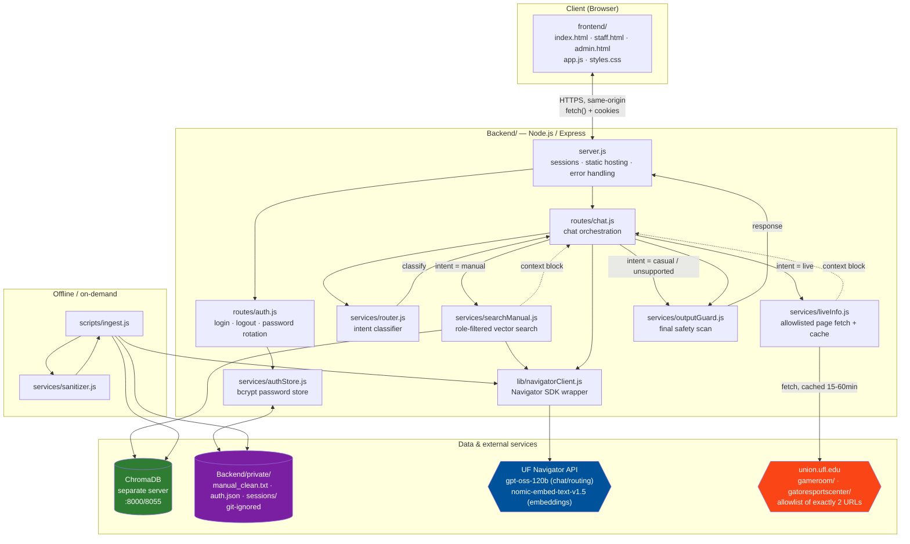

# Architecture — Gator Game Room Assistant

> Diagrams below are [Mermaid](https://mermaid.js.org/) — they render automatically on
> GitHub/GitLab and in VS Code with the Mermaid preview extension. A plain-text fallback is
> included first for any viewer that doesn't render Mermaid.

## 0. Quick-reference (plain text)

```
┌─────────────────────┐        ┌──────────────────────────────────────────────┐
│   Browser (Client)   │        │              Backend/ (Express)               │
│                      │  HTTP  │  server.js → routes/auth.js, routes/chat.js   │
│  frontend/index.html │◄──────►│       │              │                        │
│  staff.html          │ cookie │  services/router.js  services/authStore.js    │
│  admin.html          │        │       │              │                        │
│  app.js / styles.css │        │  ┌────┴────┐    Backend/private/auth.json     │
└─────────────────────┘        │  │ intent? │    (bcrypt hashes, git-ignored)  │
                                 │  └─┬─┬─┬───┘                                  │
                                 │    │ │ └─── casual/unsupported → persona     │
                                 │    │ │           prompt only, no external    │
                                 │    │ │           call                        │
                                 │    │ └── live → services/liveInfo.js         │
                                 │    │            │                            │
                                 │    └── manual → services/searchManual.js     │
                                 │                 │         │                  │
                                 └─────────────────┼─────────┼──────────────────┘
                                                    │         │
                              ┌─────────────────────┘         └───────────────┐
                              ▼                                               ▼
                 ┌─────────────────────────┐                    ┌──────────────────────────┐
                 │  union.ufl.edu          │                    │  ChromaDB (separate       │
                 │  /gameroom/,            │                    │  server, project root)    │
                 │  /gatoresportscenter/   │                    │  game_room_manual coll.   │
                 │  (allowlist, cached)    │                    └──────────────────────────┘
                 └─────────────────────────┘                                 ▲
                                                                              │ precomputed
                              ┌───────────────────────────────────┐          │ embeddings
                              │  UF Navigator API                  │◄────────┘
                              │  gpt-oss-120b (chat + routing)      │◄── every chat/embed call
                              │  nomic-embed-text-v1.5 (embeddings) │    goes through
                              └───────────────────────────────────┘    lib/navigatorClient.js

Every response passes through services/outputGuard.js before reaching the browser,
regardless of which path produced it.
```

## 1. System context



**Reading this diagram:** the browser only ever talks to the Express app (same origin, no
CORS). Every external call — to Navigator, to Chroma, to union.ufl.edu — happens
server-side. Nothing in the browser has direct access to the manual, the API key, or the
password store.

---

## 2. Request lifecycle — a single chat message

```mermaid
sequenceDiagram
    participant U as Visitor/Staff (Browser)
    participant S as server.js
    participant C as routes/chat.js
    participant R as router.js
    participant L as liveInfo.js
    participant M as searchManual.js
    participant CH as ChromaDB
    participant N as Navigator API
    participant G as outputGuard.js

    U->>S: POST /api/chat { message }
    S->>C: role = session.tier (or "public"); load session history
    C->>C: touch req.session (init history) BEFORE streaming — so Set-Cookie ships on turn 1
    C->>R: classifyAndRewrite(message, recentHistory)
    R->>N: 1 chat completion (temp 0) → JSON
    N-->>R: { intent, standalone_query }
    R-->>C: intent + standalone query (pronouns/ellipsis resolved; elliptical follow-ups → factual)
    C->>C: resolveIntent — confirm 'unsupported' in code (SECRET/OFFTOPIC) before refusing

    alt intent == live
        C->>L: fetchLiveInfo(topic) + searchManual(standaloneQuery, role) in parallel
        L->>L: cache hit (memory→disk)? return cached
        L->>N: (cache miss) fetch union.ufl.edu page (≤15k chars)
        L-->>C: live content (+ manual passages BLENDED as supplement)
        C->>C: closureAlertForToday — inject hard CLOSURE ALERT if today is in a closure notice
    else intent == manual
        C->>M: searchManual(standaloneQuery, role)  [HYBRID]
        M->>N: embed(sub-queries)
        M->>CH: vector query(where: role filter) + get() for BM25 corpus
        CH-->>M: candidates + metadata + distances
        M->>M: fuse vector + BM25 via RRF; re-check access_level per chunk
        M-->>C: fused passages (role-safe) or []
    else casual / unsupported
        Note over C: unsupported short-circuits to a canned refusal (no generation)
    end

    Note over C: if the message was elliptical, inject a 1-line system hint with the resolved<br/>query ("interpreted in context: 'is foosball free'") right before the user message
    C->>N: chat completion (persona prompt + context block + recent history + [hint] + message)
    N-->>C: draft reply
    C->>G: guard(draft reply)
    G->>G: tiered scan — 'block' shapes replace whole reply; 'redact' shapes masked inline
    alt block-tier match
        G-->>C: RESTRICTED canned message
    else clean / inline-redacted
        G-->>C: reply (verbatim or with spans masked)
    end
    C->>C: build STRUCTURED sources (manual and/or live; top ≤2 sections; none for canned refusals)
    C->>C: recordTurn(history) + analyticsStore.logQuestion(answered?)
    C-->>U: { response, sources }   %% UI renders sources as a hover ⓘ badge, not a text footer
```

---

## 3. Ingestion pipeline (`npm run ingest`, run on demand — not per-request)

```mermaid
flowchart LR
    A["Backend/private/<br/>manual_clean.txt"] --> B["sanitizer.js<br/>redact credentials/codes/phones/<br/>emails/account numbers<br/>BEFORE anything is embedded"]
    B --> C["parseSections()<br/>Markdown/ALL-CAPS headings only +<br/>[PUBLIC]/[STAFF]/[SUPERVISOR] markers"]
    C --> D["chunkParagraphs() → addOverlap()<br/>~800 char chunks + ~15% inter-chunk<br/>overlap (within a section)"]
    D --> E["detectAccessLevel()<br/>explicit marker → keyword heuristic<br/>→ default: staff (restrictive)"]
    E --> CTX["contextualizeChunk() (CONTEXTUAL_CHUNKING, default on)<br/>prepend 1 LLM-generated context sentence<br/>from already-sanitized text; raw-chunk fallback on failure"]
    CTX --> F["navigatorClient.embed()<br/>one Navigator call per chunk"]
    F --> G["chromaClient.resetCollection()<br/>full delete + rebuild every run,<br/>no embedding function, no incremental cache"]
    G --> H[("ChromaDB<br/>game_room_manual collection<br/>id · document · embedding · metadata")]
```



Ingestion is callable two ways: the `npm run ingest` CLI, and programmatically via
`ingestManual()` (used by the admin `POST /api/admin/reingest` endpoint, which also refreshes
the in-process BM25 index). Access tiers are now four-level: `public < staff < supervisor <
admin`, with `[SUPERVISOR]` reserved for leadership/escalation, refund, and payment-card
handling content.

Note: numbered lines (`1. Do the thing`) are deliberately not treated as headings — a real
manual has numbered steps *inside* procedures, and a heading heuristic that can't distinguish
"1. Introduction" from "1. Post your shift for trade" will fragment a procedure into multiple
chunks, some of which can then be misclassified by the access-level keyword heuristic. This
was found as a real bug during testing against an actual operations manual (see
`docs/PROJECT_REPORT.md`, defect 13) and fixed by dropping numbered-heading support entirely.

Ingestion always does a **full rebuild**, not an incremental update — chunk boundaries shift
whenever the source text changes, so there's no reliable way to say "this chunk is unchanged"
without risking stale/orphaned vectors. At the current manual size this costs a few seconds
per run; see `docs/PROJECT_REPORT.md` Section 6 for the tradeoff discussion.

---

## 4. Directory-to-responsibility map

| Folder | Responsibility | Talks to |
|---|---|---|
| `frontend/` | Presentation only — no business logic, no secrets | `Backend/` via `fetch()` |
| `Backend/routes/` | HTTP boundary — request validation, session reads | `Backend/services/` |
| `Backend/services/` | All business logic (routing, retrieval, safety, auth) | `Backend/lib/`, ChromaDB, `Backend/private/` |
| `Backend/lib/` | Thin wrappers around external APIs + prompt templates | UF Navigator API |
| `Backend/middleware/` | Cross-cutting request guards (tier enforcement) | `Backend/routes/` |
| `Backend/scripts/` | Offline/maintenance tasks (`ingest.js`, `eval.js`) | `Backend/services/`, ChromaDB, live server |
| `Backend/eval/` | 50-question evaluation set (`questions.js`) | consumed by `scripts/eval.js` |
| `Backend/private/` | Secrets + sensitive data, git-ignored (manual, auth.json, sessions/, live_cache.json, questions.jsonl, feedback.jsonl) | filesystem only |
| `chroma_data/` (root) | ChromaDB's own persisted vector storage | ChromaDB server process |

Key services added post-handoff: `services/keywordIndex.js` (in-process BM25),
`services/analyticsStore.js` (append-only question/feedback logs), `routes/admin.js`
(admin-gated content management + log APIs). Frontend gained `admin-content.html` (new admin
page); the existing chat/landing UI is unchanged.

---

## 5. Why the router lives in code, not in the model

`gpt-oss-120b` is never given `tool_choice=auto` / native function-calling. Instead,
`services/router.js` makes one call that both **classifies intent and rewrites the message
into a standalone query** (resolving pronouns/ellipsis against recent conversation history),
and `routes/chat.js` decides — in plain JavaScript — which service to call next. This means
every safety check (role filtering, allowlist enforcement, output scanning) sits in code
that's testable and auditable, not inside a model's own judgment about when to call a tool. It
also makes the failure mode predictable: if the router call itself fails (network error), the
error propagates honestly; only a *malformed-but-successful* response is defaulted (to a
grounded manual attempt), never to a wrongful refusal.

---

## 6. Capabilities added after the initial handoff

- **Conversation memory** — recent turns are kept in the file-backed session and fed to both
  the router and the answer model; `POST /api/chat/reset` clears it. No client change.
- **Hybrid retrieval** — `searchManual.js` fuses vector search with an in-process BM25 index
  (`keywordIndex.js`) via reciprocal-rank fusion, so exact terms (BOGO, PERF, Connect2) surface
  even when embeddings blur them. Role filtering is re-enforced on both paths.
- **Live + manual blending** — a `live` turn retrieves both sources; the page stays
  authoritative for volatile facts, the manual supplies policies it omits. Manual also carries
  the turn as a labeled fallback when the page is unreachable; the live cache is disk-durable.
- **Four-tier access** — `public < staff < supervisor < admin`, with a real supervisor login
  and `[SUPERVISOR]`-tagged content.
- **Admin self-improvement surface** — `routes/admin.js` (admin-gated): read/edit the manual,
  trigger re-ingest, and view question/feedback logs, including what the bot *couldn't* answer.
- **Abuse/cost controls** — `/api/chat` is rate-limited; the output guard is tiered (block vs
  inline-redact) with Luhn-gated card detection.
- **Evaluation harness** — `npm run eval` drives `Backend/eval/questions.js` (50 graded
  questions incl. adversarial/tier-boundary cases) against a live server. Current bar: 50/50.

Robustness pass (M9):
- **Same-day closure guard** — `liveInfo.closureAlertForToday` + prompt rules make the bot fail
  safe on holidays/closures instead of confidently saying "open" (fixed a real July-4 live bug).
- **Router reliability** — `resolveIntent` confirms an `unsupported` classification in code
  before hard-refusing, so the LLM router no longer wrongly refuses legit questions it mislabels;
  few-shot examples further stabilize it.
- **Structured sources + hover badge** — responses return `{ response, sources }`; the UI shows a
  compact ⓘ badge. Live+manual are combined bidirectionally so answers are more precise (and
  contact facts the sanitizer redacts from the manual are pulled from the live page).
- **Hardened input validation + stress suite** — non-string message bodies rejected; a
  33-case `test/edgecases.test.js` exercises hostile/degenerate inputs.

Quality pass (M10):
- **Anonymous session memory on the streamed path** — `POST /api/chat` touches `req.session`
  before the first `startStream()` so express-session's `Set-Cookie` reaches the browser on turn
  1; without it, streamed-response headers flush before the session is written and every
  not-logged-in visitor got a fresh, memory-less session per message (persona-harness defect 15).
- **Elliptical follow-up resolution** — bare follow-ups ("is it free?") are routed as factual and
  rewritten to a standalone query for retrieval, and a one-line resolved-query hint is injected
  before the model answers, so it responds to the intended antecedent, not the pronoun (issue #6).
- **Contextual-retrieval chunking** — `scripts/ingest.js` prepends an LLM-generated context
  sentence to each chunk before embedding (`CONTEXTUAL_CHUNKING`, default on), improving recall
  for terse/follow-up queries; derived only from sanitized text, with a raw-chunk fallback.
- **Opt-in ReACT retrieval planner** — `services/reactAgent.js` (`REACT_MODE`, default off): a
  bounded, role-scoped, read-only Thought→Action→Observation loop; single-shot remains default
  because it scored higher on the persona stress harness.
- **Persona stress harness** — five human personas × ~125 tagged multi-turn questions per run,
  used as the break-and-fix loop; stable 125/125. Unit suite: 165 tests.
